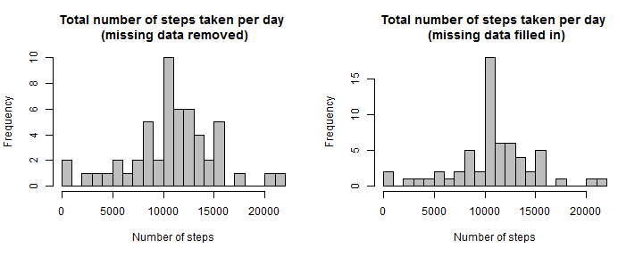

# Introduction

It is now possible to collect a large amount of data about personal movement using activity monitoring devices such as a [Fitbit](http://www.fitbit.com/), [Nike Fuelband](http://www.nike.com/us/en_us/c/nikeplus-fuelband), or [Jawbone Up](https://jawbone.com/up). These type of devices are part of the ¡°quantified self¡± movement ¨C a group of enthusiasts who take measurements about themselves regularly to improve their health, to find patterns in their behavior, or because they are tech geeks. But these data remain under-utilized both because the raw data are hard to obtain and there is a lack of statistical methods and software for processing and interpreting the data.

This assignment makes use of data from a personal activity monitoring device. This device collects data at 5 minute intervals through out the day. The data consists of two months of data from an anonymous individual collected during the months of October and November, 2012 and include the number of steps taken in 5 minute intervals each day.


# Data

The data for this assignment can be downloaded from the course web site:

- Dataset: [Activity monitoring data](https://d396qusza40orc.cloudfront.net/repdata%2Fdata%2Factivity.zip) [52K]

The variables included in this dataset are:

- **steps:** Number of steps taking in a 5-minute interval (missing values are coded as `NA`)
- **date:** The date on which the measurement was taken in `YYYY-MM-DD` format
- **interval:** Identifier for the 5-minute interval in which measurement was taken

The dataset is stored in a comma-separated-value (`CSV`) file and there are a total of 17,568 observations in this dataset.


# Submitting the Assignment

To submit the assignment:

1. Commit the your completed `PA1_template.Rmd` file to the `master` branch of your git repository (you should already be on the `master` branch unless you created new ones)

2. Commit your `PA1_template.md` and `PA1_template.html` files produced by processing your R markdown file with `knit2html()` function in R (from the knitr package) by running the function from the console.

3. If your document has figures included (it should) then they should have been placed in the `figure/` directory by default (unless you overrided the default). Add and commit the `figure/` directory to your git repository so that the figures appear in the markdown file when it displays on github.

4. Push your `master` branch to GitHub.

5. Submit the **URL to your GitHub repository** for this assignment on the course web site.

In addition to submitting the **URL for your GitHub repository**, you will need to submit the **40 character SHA-1 hash** (as string of numbers from 0-9 and letters from a-f) that identifies the repository commit that contains the version of the files you want to submit. You can do this in GitHub by doing the following

1. Going to your GitHub repository web page for this assignment

2. Click on the `¡°?? commits¡±` link where ?? is the number of commits you have in the repository. For example, if you made a total of 10 commits to this repository, the link should say ¡°10 commits¡±.

3. You will see a list of commits that you have made to this repository. The most recent commit is at the very top. If this represents the version of the files you want to submit, then just click the `¡°copy to clipboard¡±` button on the right hand side that should appear when you hover over the `SHA-1 hash`. Paste this `SHA-1 hash` into the course web site when you submit your assignment. If you don't want to use the most recent commit, then go down and find the commit you want and copy the `SHA-1 hash`.

A valid submission will look something like (this is just an example!)

```
https://github.com/rdpeng/RepData_PeerAssessment1

7c376cc5447f11537f8740af8e07d6facc3d9645
```


# Assignment

This assignment will be described in multiple parts. You will need to write a report that answers the questions detailed below. Ultimately, you will need to complete the entire assignment in a **single R markdown** document that can be processed by **knitr** and be transformed into an **HTML** file.

Throughout your report make sure you always include the code that you used to generate the output you present. When writing code chunks in the R markdown document, always use `echo = TRUE` so that someone else will be able to read the code. **This assignment will be evaluated via peer assessment so it is essential that your peer evaluators be able to review the code for your analysis.**

For the plotting aspects of this assignment, feel free to use any plotting system in R (i.e., **base**, **lattice**, **ggplot2**)

Fork/clone the [GitHub repository created for this assignment](http://github.com/rdpeng/RepData_PeerAssessment1). You will submit this assignment by pushing your completed files into your forked repository on GitHub. The assignment submission will consist of the **URL to your GitHub repository** and the **SHA-1 commit ID** for your repository state.

**NOTE:** The GitHub repository also contains the dataset for the assignment so you do not have to download the data separately.


## Set the R environment


```r
library(lattice)
library("knitr")
opts_chunk$set(echo=TRUE, results="hold")
Sys.setlocale("LC_TIME", "English")
```

```
## [1] "English_United States.1252"
```


## Loading and preprocessing the data

Show any code that is needed to

1. Load the data (i.e. `read.csv()`)


```r
dtRAW <- read.csv('activity.csv', header = TRUE, na.strings = "NA", stringsAsFactors=FALSE)
str(dtRAW)
head(dtRAW)
tail(dtRAW)
```

```
## 'data.frame':	17568 obs. of  3 variables:
##  $ steps   : int  NA NA NA NA NA NA NA NA NA NA ...
##  $ date    : chr  "2012-10-01" "2012-10-01" "2012-10-01" "2012-10-01" ...
##  $ interval: int  0 5 10 15 20 25 30 35 40 45 ...
##   steps       date interval
## 1    NA 2012-10-01        0
## 2    NA 2012-10-01        5
## 3    NA 2012-10-01       10
## 4    NA 2012-10-01       15
## 5    NA 2012-10-01       20
## 6    NA 2012-10-01       25
##       steps       date interval
## 17563    NA 2012-11-30     2330
## 17564    NA 2012-11-30     2335
## 17565    NA 2012-11-30     2340
## 17566    NA 2012-11-30     2345
## 17567    NA 2012-11-30     2350
## 17568    NA 2012-11-30     2355
```

2. Process/transform the data (if necessary) into a format suitable for your analysis


```r
dtRAW$date <- as.Date(dtRAW$date, "%Y-%m-%d")
str(dtRAW)
head(dtRAW)
tail(dtRAW)
```

```
## 'data.frame':	17568 obs. of  3 variables:
##  $ steps   : int  NA NA NA NA NA NA NA NA NA NA ...
##  $ date    : Date, format: "2012-10-01" "2012-10-01" ...
##  $ interval: int  0 5 10 15 20 25 30 35 40 45 ...
##   steps       date interval
## 1    NA 2012-10-01        0
## 2    NA 2012-10-01        5
## 3    NA 2012-10-01       10
## 4    NA 2012-10-01       15
## 5    NA 2012-10-01       20
## 6    NA 2012-10-01       25
##       steps       date interval
## 17563    NA 2012-11-30     2330
## 17564    NA 2012-11-30     2335
## 17565    NA 2012-11-30     2340
## 17566    NA 2012-11-30     2345
## 17567    NA 2012-11-30     2350
## 17568    NA 2012-11-30     2355
```


## What is mean total number of steps taken per day?

For this part of the assignment, you can ignore the missing values in the dataset.

1. Calculate the total number of steps taken per day


```r
totalSPD <- aggregate(steps~date, data=dtRAW, FUN=sum, na.rm=TRUE)
str(totalSPD)
head(totalSPD)
tail(totalSPD)
```

```
## 'data.frame':	53 obs. of  2 variables:
##  $ date : Date, format: "2012-10-02" "2012-10-03" ...
##  $ steps: int  126 11352 12116 13294 15420 11015 12811 9900 10304 17382 ...
##         date steps
## 1 2012-10-02   126
## 2 2012-10-03 11352
## 3 2012-10-04 12116
## 4 2012-10-05 13294
## 5 2012-10-06 15420
## 6 2012-10-07 11015
##          date steps
## 48 2012-11-24 14478
## 49 2012-11-25 11834
## 50 2012-11-26 11162
## 51 2012-11-27 13646
## 52 2012-11-28 10183
## 53 2012-11-29  7047
```

2. If you do not understand the difference between a histogram and a barplot, research the difference between them. Make a histogram of the total number of steps taken each day


```r
hist(totalSPD$steps, breaks=20, col="grey",
     main="Total number of steps taken per day \n (missing data removed)",
     xlab="Number of steps")
```

 

3. Calculate and report the mean and median of the total number of steps taken per day


```r
muTSPD <- mean(totalSPD$steps)
meTSPD <- median(totalSPD$steps)
```
The mean of total number of steps taken per day is 1.0766189 &times; 10<sup>4</sup>.

The median of total number of steps taken per day is 10765.


## What is the average daily activity pattern?

1. Make a time series plot (i.e. `type = "l"`) of the 5-minute interval (x-axis) and the average number of steps taken, averaged across all days (y-axis)


```r
muSPI <- aggregate(steps~interval, data=dtRAW, FUN=mean, na.rm=TRUE)
plot(muSPI, type="l",
     main="Average number of steps per 5-minute interval",
     xlab="5-minute intervals",
     ylab="Average numberof steps")
```

 

2. Which 5-minute interval, on average across all the days in the dataset, contains the maximum number of steps?


```r
numMaxStep <- muSPI[which(muSPI$steps==max(muSPI$steps)), ]$interval
```

The 5-minute interval with maximum average number of steps is no. 835.


## Imputing missing values

Note that there are a number of days/intervals where there are missing values (coded as `NA`). The presence of missing days may introduce bias into some calculations or summaries of the data.

1. Calculate and report the total number of missing values in the dataset (i.e. the total number of rows with `NA`s)


```r
numNA <- nrow(dtRAW[which(is.na(dtRAW$steps)),])
```

The total number of missing values in the dataset is 2304.


2. Devise a strategy for filling in all of the missing values in the dataset. The strategy does not need to be sophisticated. For example, you could use the mean/median for that day, or the mean for that 5-minute interval, etc.

```
The strategy for filling missing values will be replacing missing values with the average number of steps in each 5-minute interval.
```

3. Create a new dataset that is equal to the original dataset but with the missing data filled in.


```r
dtNEW <- transform(dtRAW,
                   steps=ifelse(is.na(dtRAW$steps),
                                muSPI[match(muSPI$interval, dtRAW$interval), ]$steps,
                                dtRAW$steps))
sum(is.na(dtNEW))
str(dtNEW)
head(dtNEW)
tail(dtNEW)
```

```
## [1] 0
## 'data.frame':	17568 obs. of  3 variables:
##  $ steps   : num  1.717 0.3396 0.1321 0.1509 0.0755 ...
##  $ date    : Date, format: "2012-10-01" "2012-10-01" ...
##  $ interval: int  0 5 10 15 20 25 30 35 40 45 ...
##       steps       date interval
## 1 1.7169811 2012-10-01        0
## 2 0.3396226 2012-10-01        5
## 3 0.1320755 2012-10-01       10
## 4 0.1509434 2012-10-01       15
## 5 0.0754717 2012-10-01       20
## 6 2.0943396 2012-10-01       25
##           steps       date interval
## 17563 2.6037736 2012-11-30     2330
## 17564 4.6981132 2012-11-30     2335
## 17565 3.3018868 2012-11-30     2340
## 17566 0.6415094 2012-11-30     2345
## 17567 0.2264151 2012-11-30     2350
## 17568 1.0754717 2012-11-30     2355
```


4. Make a histogram of the total number of steps taken each day and Calculate and report the mean and median total number of steps taken per day. Do these values differ from the estimates from the first part of the assignment? What is the impact of imputing missing data on the estimates of the total daily number of steps?


```r
newTSPD <- aggregate(steps~date, data=dtNEW, FUN=sum, na.rm=TRUE)
muNTSPD <- mean(newTSPD$steps)
meNTSPD <- median(newTSPD$steps)
hist(newTSPD$steps, breaks=20, col="grey",
     main="Total number of steps taken per day \n (missing data filled in)",
     xlab="Number of steps")
```

 

The mean of total number of steps taken per day is 1.0766189 &times; 10<sup>4</sup>.

The median of total number of steps taken per day is 1.0766189 &times; 10<sup>4</sup>.

Comparison of mean and median of total number of steps taken per day with missing data removed vs. filled in


```r
mumeComp <- data.frame("mean"=c(muTSPD, muNTSPD), "median"=c(meTSPD, meNTSPD))
rownames(mumeComp) <- c("naRrmoved", "naFilled")
mumeComp
```

```
##               mean   median
## naRrmoved 10766.19 10765.00
## naFilled  10766.19 10766.19
```

Comparison of histogram of total number of steps taken each day with missing data removed vs. filled in


```r
par(mfrow=c(1, 2))
hist(totalSPD$steps, breaks=20, col="grey",
     main="Total number of steps taken per day \n (missing data removed)",
     xlab="Number of steps")
hist(newTSPD$steps, breaks=20, col="grey",
     main="Total number of steps taken per day \n (missing data filled in)",
     xlab="Number of steps")
```

 

```r
par(mfrow=c(1, 1))
```

Imputing missing data changes the distribution of the histogram for total daily number of steps.


## Are there differences in activity patterns between weekdays and weekends?

For this part the `weekdays()` function may be of some help here. Use the dataset with the filled-in missing values for this part.

1. Create a new factor variable in the dataset with two levels ¨C ¡°weekday¡± and ¡°weekend¡± indicating whether a given date is a weekday or weekend day.


```r
dtNEW$weekdays <- as.factor(ifelse(weekdays(dtNEW$date) %in% c("Saturday", "Sunday"),
                                  "weekend", "weekday"))
str(dtNEW)
head(dtNEW)
tail(dtNEW)
```

```
## 'data.frame':	17568 obs. of  4 variables:
##  $ steps   : num  1.717 0.3396 0.1321 0.1509 0.0755 ...
##  $ date    : Date, format: "2012-10-01" "2012-10-01" ...
##  $ interval: int  0 5 10 15 20 25 30 35 40 45 ...
##  $ weekdays: Factor w/ 2 levels "weekday","weekend": 1 1 1 1 1 1 1 1 1 1 ...
##       steps       date interval weekdays
## 1 1.7169811 2012-10-01        0  weekday
## 2 0.3396226 2012-10-01        5  weekday
## 3 0.1320755 2012-10-01       10  weekday
## 4 0.1509434 2012-10-01       15  weekday
## 5 0.0754717 2012-10-01       20  weekday
## 6 2.0943396 2012-10-01       25  weekday
##           steps       date interval weekdays
## 17563 2.6037736 2012-11-30     2330  weekday
## 17564 4.6981132 2012-11-30     2335  weekday
## 17565 3.3018868 2012-11-30     2340  weekday
## 17566 0.6415094 2012-11-30     2345  weekday
## 17567 0.2264151 2012-11-30     2350  weekday
## 17568 1.0754717 2012-11-30     2355  weekday
```

2. Make a panel plot containing a time series plot (i.e. `type = "l"`) of the 5-minute interval (x-axis) and the average number of steps taken, averaged across all weekday days or weekend days (y-axis). See the README file in the GitHub repository to see an example of what this plot should look like using simulated data.


```r
weekSPI <- aggregate(steps ~ weekdays + interval, dtNEW, FUN=mean, na.rm=TRUE)
xyplot(steps ~ interval | weekdays, data=weekSPI, type="l", layout=c(1, 2),
       xlab="Interval", ylab="Number of steps")
```

 

